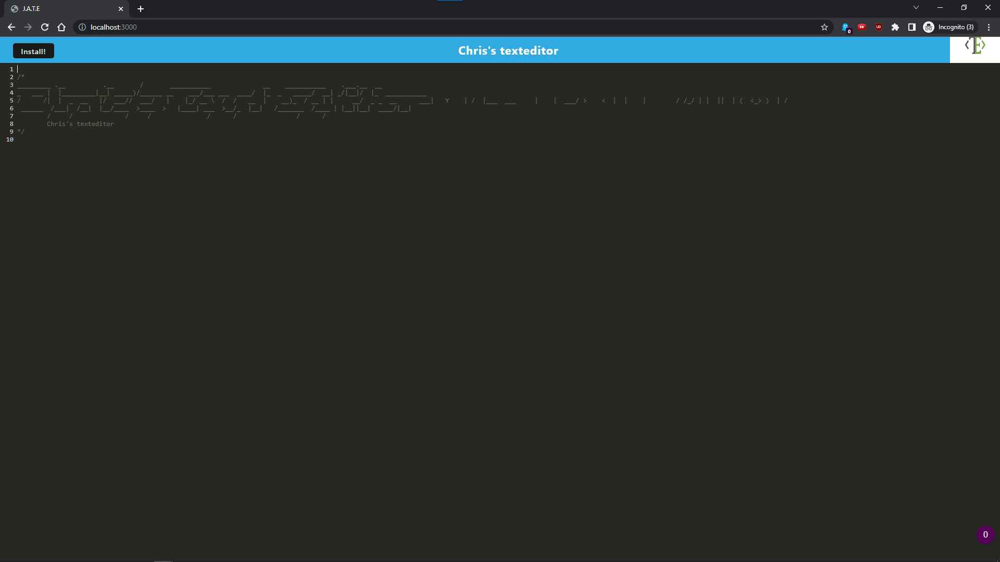

# PWA-editor

  ## Table of Contents:
  1. [Description](#description) 
  2. [Installation](#installation)
  3. [Usage](#usage)
  5. [Test Instructions](#testInstructions)
  6. [License](#license)
  7. [Questions](#questions)
  ## Description 

Online/Offline texteditor powered with PWA

  ## Installation 

npm i, npm run start

  ## Usage 

  

  ## Contribution Guidelines 

fork away!

  ## Test Instructions 

  n/a

  ## license 

  MIT

  ## Questions 

[chrisotpher mowrey](https://github.com/christophermowrey)

